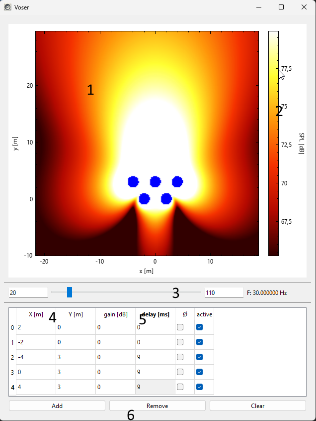

# VOSER
**Vojtův otevřený simulátor exteriérových reproduktorů** / 
**Vojta's open source outdoors speaker simulator**

Voser helps you calculate acoustic field created by multiple sources. In voser, simplicity is prefered over advanced features.

**Fun fact**

The name - *Voser* is a czech concept standing for an endeavor marked by formidable intricacy and unforeseen challenges, demanding exceptional patience, resilience, and tenacity. Does it sound like an opposite of ease?

## How to use

Voser consists of single window UI.

1. **Plot area** - use drag to move and mouse scroll to zoom
2. **Magnitude bar** - for quick look, you may drag/scroll, it autoscales
3. **Frequency bar** - set low and high frequency and then slide
4. **X / Y** - acoustic source coordinates
5. **gain / delay / polarity flip / unmute** - basic processing for particular acoustic source
6. **Add / Remove / Clear** - use to create you list of sources

In this picture, Voser is showing basic endfire setup consisting of 5 subwoofers.
## How does it work

In voser, acoustic field is computed point by point.

Acoustic wave from one acoustic source is described by its magnitude and phase. Phase is determied by initial phase of source and its distance. Magnitude in calculated according to [inverse square law](https://en.wikipedia.org/wiki/Inverse-square_law).

Firstly, a "list of waves" from each source is computed for each point. Then, waves are combined using formulas derived from trigonometric sum identities.

### Voser can
 - calculate (and visualise) acoustic field created by multiple sources (loudspeakers)
 - account for basic processing for each source (gain, delay, polarity flip)
 - help you design your loudspeaker setup

### Voser cannot
 - Take account of realistic loudspeaker models (directivity, phase/magnitude responses...)
 - Simulate advanced processing (IIR/FIR filters...)
 - Compute sound reflections (/calculate for standing wave modes...)
 - Efficiently simulate horns, HF arrays with beamsteering
 - Model speakers in 3D

This realtively simple approach makes voser reasonable tool for designing PA subwoofer array especially for use in open-air areas. Skilled audio engineer may use Voser to get idea how speaker setups may behave, but outputs may not be directly aplicable.

